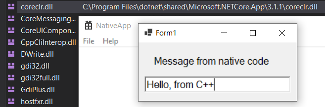

# Porting a C++/CLI Project to .NET Core

One of the new features of Visual Studio 2019 version 16.4 and .NET Core 3.1 is the ability to build C++/CLI projects targeting .NET Core. This can be done either directly with *cl.exe* and *link.exe* (using the new `/clr:netcore` option) or via MSBuild (using `<CLRSupport>NetCore</CLRSupport>`). In this post, I'll walk through the steps necessary to migrate a simple C++/CLI interop project to .NET Core. More details can be found in [.NET Core documentation](https://docs.microsoft.com/dotnet/core/porting/cpp-cli).

## The sample project

First, I need to make a sample solution to migrate. I'm going to use an app with a native entry point that displays a Windows Forms form via C++/CLI. Migrating a solution with a managed entry point interoperating with native dependencies via C++/CLI would be just as easy, though. To get started, I've created a solution with three projects:

1. **NativeApp** A C++ Windows app from Visual Studio's 'Windows Desktop Application' template.
    1. This will be the app's entry point.
    1. I've updated it to display the managed form (via the `CppCliInterop` project) and call a method on it when the `IDM_ABOUT` command is invoked.
1. **ManagedLibrary** A C# Windows Forms library targeting .NET Core.
    1. This will provide a WinForms form for the native app to display.
    1. I've added a text box to the form and a method to set the text box's text. I've also multi-targeted this project for .NET Core and .NET Framework so that it can be used with either. This way we can focus on migrating just the C++/CLI portion of the sample.
1. **CppCliInterop** A .NET Framework C++/CLI library.
    1. This will be used as the interop layer to connect the app to the managed WinForms library.
    1. It references `ManagedLibrary` and allows native projects to use it.
    1. This is the project that needs migrated to .NET Core.

The sample code is available [on GitHub](https://github.com/mjrousos/CppCliMigrationSample). When you start the app, if you click on the Help -> About menu, the WinForms form will be displayed with text in its text box supplied by the NativeApp project.

## Migrating a vcxproj to .NET Core

Now for the interesting part - updating the sample app to run on .NET Core. The changes needed are actually quite minimal. If you've migrated C# projects to .NET Core before, migrating C++/CLI projects is even simpler because the project file format doesn't change. With managed projects, .NET Core and .NET Standard projects use the new SDK-style project file format. For C++/CLI projects, though, the same vcxproj format is used to target .NET Core as .NET Framework.

All that's needed is to make a few changes to the project file. Some of these can be done through the Visual Studio IDE (using the 'Advanced Properties' tab of project configuration), but others (such as adding WinForms references) can't be yet. So the easiest way to update the project file, currently, is to just unload the project in VS and edit the vcxproj directly or to use an editor like VS Code or Notepad.

1. Replace `<CLRSupport>true</CLRSupport>` with `<CLRSupport>NetCore</CLRSupport>`. This tells the compiler to use `/clr:netcore` instead of `/clr` when building.
    1. This change can be done through Visual Studio's project configuration interface if you prefer.
    1. Note that `<CLRSupport>` is specified separately in each configuration/platform-specific property group in the sample project's project file, so the update needs to be made four different places.
1. Replace `<TargetFrameworkVersion>4.7</TargetFrameworkVersion>` with `<TargetFramework>netcoreapp3.1</TargetFramework>`.
1. Replace .NET Framework references (to System, System.Data, System.Windows.Forms, and System.Xml) with the following reference to WinForms components from the Windows Desktop .NET Core SDK. This step doesn't have Visual Studio IDE support yet, so it must be done by editing the vcxproj directly. Notice that only a reference to the Windows Desktop SDK is needed because the .NET Core SDK (which includes libraries like System, System.Xml, etc.) is included automatically. There are different Framework references for WinForms, WPF, or both (as explained in the [migration docs](https://docs.microsoft.com/dotnet/core/porting/cpp-cli)).
    ```xml
    <FrameworkReference Include="Microsoft.WindowsDesktop.App.WindowsForms" />
    ```

With those changes made, the C++/CLI project will build successfully targeting .NET Core. If you're using Visual Studio 2019 16.4, though, the app won't run yet. There's one more step to get it working.

When .NET Core's CoreCLR runtime loads, it uses a .runtimeconfig.json file to know which version of .NET Core to run against. Managed .NET Core apps generate this file automatically (so, if we were migrating an app with a managed entry point, the migrated app would already work). Up until Visual Studio 2019 16.5 preview 2, though, C++/CLI libraries didn't generate this file, so it had to be added manually if a managed assembly hadn't already initialized .NET Core before the C++/CLI library was used. This [has been fixed](https://github.com/dotnet/sdk/pull/4063) in Visual Studio 2019 16.5 preview 2. So, if you're using the latest Visual Studio preview, the migration is done! If an older version of Visual Studio is being used, we'll need to create this *CppCliInterop.runtimeconfig.json* file manually and make sure it's copied to the output directory:

```json
{
  "runtimeOptions": {
    "tfm": "netcoreapp3.1",
    "framework": {
      "name": "Microsoft.WindowsDesktop.App",
      "version": "3.1.0"
    }
  }
}
```

The app can now run on .NET Core! A migrated version of the source is available in [the NetCore branch](https://github.com/mjrousos/CppCliMigrationSample/tree/netcore) in the sample's GitHub repository. Here's the Windows form running in front of the loaded modules showing coreclr.dll loaded.



## Building without MSBuild

Migrating this sample app to .NET Core was simply a matter of updating the project file to target .NET Core instead of .NET Framework. If you need to build C++/CLI assemblies directly with *cl.exe* and *link.exe*, that's supported, too. The necessary steps are:

1. Use `/clr:netcore` in place of `/clr` when calling *cl.exe*.
1. Reference necessary .NET Core reference assemblies using `/FU` (.NET Core reference assemblies are typically installed under *%ProgramFiles%\dotnet\packs\\<SDK\>\\<Version\>\ref*).
1. When linking, include the .NET Core app host directory as a `LibPath`. The .NET Core app host files are typically installed under *%ProgramFiles%\dotnet\packs\Microsoft.NETCore.App.Host.win-x64\\<Version\>\runtime\win-x64\native*).
1. Make sure that *ijwhost.dll* (which is needed to start the .NET Core runtime) is copied locally from the .NET Core app host location. MSBuild does this automatically if building a vcxproj project.
1. Create a *.runtimeconfig.json* file, as discussed previously.

## A few caveats

As you can see, with Visual Studio 2019 16.4 and .NET Core 3.1, targeting .NET Core with C++/CLI projects is easy. There are a few C++/CLI limitations to look out for, though.

1. C++/CLI support is Windows only, even when running on .NET Core. If you need interoperability cross-platform, use [platform invokes](https://docs.microsoft.com/dotnet/framework/interop/platform-invoke-examples).
1. C++/CLI projects cannot target .NET Standard - only .NET Core or .NET Framework - and multi-targeting isn't supported, so building a library that will be used by both .NET Framework and .NET Core callers will require two project files.
1. If a project uses APIs that aren't available in .NET Core, those calls will need to be updated to .NET Core alternatives. The [.NET Portability Analyzer](https://github.com/Microsoft/dotnet-apiport) can help to find any Framework dependencies that won't work on .NET Core.

## Wrap-up and resources

Hopefully this sample shows how to take advantage of the new functionality in Visual Studio 2019 16.4 and .NET Core 3.1 to migrate C++/CLI projects to .NET Core. The following links may be useful for further reading.

* [C++/CLI .NET Core migration docs](https://docs.microsoft.com/dotnet/core/porting/cpp-cli)
* [The sample used in this post](https://github.com/mjrousos/CppCliMigrationSample) (the original sample is in the master branch and the .NET Core updates are in the netcore branch)
* [.NET Portability Analyzer](https://github.com/Microsoft/dotnet-apiport)